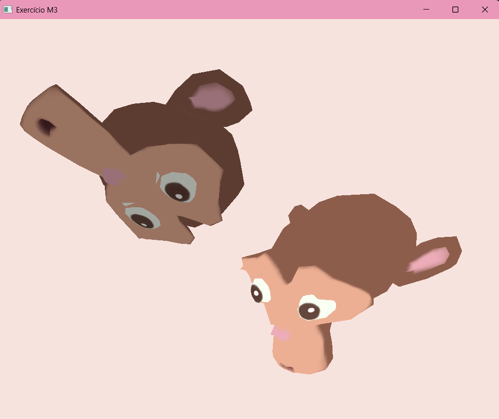

# Exercício do Módulo 3 - Adicionando Texturas

Trabalho da disciplina de Computação Gráfica (Unisinos).

Dando continuidade ao visualizador, agora os modelos aparecem texturizados.
O programa lê as coordenadas de textura do arquivo `.OBJ`, descobre qual imagem
usar a partir do arquivo `.MTL`, carrega essa imagem e desenha os objetos com
a textura aplicada.



## O que foi implementado neste módulo

- Leitura das coordenadas de textura (linhas `vt`) do arquivo `.OBJ`
- Leitura do segundo índice das faces (`v/vt/vn`), que diz qual coordenada de
  textura pertence a cada vértice
- Buffer de vértices reorganizado: cada vértice agora guarda `x, y, z, s, t`
- Leitura do arquivo `.MTL` para descobrir o nome da textura (`map_Kd`)
- Carregamento da imagem com a stb_image e desenho com `sampler2D` no shader

Nada de caminho fixo no código: o `.obj` aponta para o `.mtl`, que aponta para
o `.png`. O programa segue essa cadeia sozinho e monta os caminhos a partir da
pasta onde o modelo está.

Um detalhe que deu trabalho: a imagem é lida de cima para baixo, mas o OpenGL
espera a origem da textura embaixo à esquerda. Sem
`stbi_set_flip_vertically_on_load(true)` a textura aparece de cabeça para baixo.

## Mantido dos módulos anteriores

Dois objetos na cena, seleção por teclado e transformações (rotação, translação
e escala). O objeto não selecionado aparece escurecido.

## Como compilar e rodar

Precisa de CMake e um compilador C++. Usamos o MSYS2 com o VS Code no Windows.
O CMake baixa a GLFW, a GLM e a stb_image sozinho.

```bash
git clone <link-do-repositorio>
cd <pasta-do-projeto>
cmake -S . -B build
cmake --build build
```

Para rodar, entre na pasta `build` (senão o programa não acha os modelos):

```bash
cd build
./Exercicio_M3        # no Windows: .\Exercicio_M3.exe
```

Os arquivos do modelo ficam em `assets/Modelos3D/` e precisam estar juntos:
`Suzanne.obj`, `Suzanne.mtl` e `Suzanne.png`.

## Controles

| Tecla        | O que faz                                  |
| ------------ | ------------------------------------------ |
| TAB          | alterna o objeto selecionado               |
| R / T / S    | modo rotação / translação / escala         |
| X / Y / Z    | aplica a transformação no eixo escolhido   |
| Shift + eixo | inverte o sentido                          |
| U            | liga/desliga a escala uniforme             |
| Setas        | translada nos eixos X e Y                  |
| Espaço       | volta a cena para o estado inicial         |
| P            | alterna entre malha preenchida e wireframe |
| ESC          | fecha o programa                           |

O modo começa em translação. O modo escolhido e o objeto selecionado aparecem
no console.

## Referências

- Código base do leitor de OBJ e do `loadTexture`: repositório da disciplina
- [stb_image](https://github.com/nothings/stb)
- Material de apoio do Módulo 3 (texturas em OpenGL)

---

Alunas: Eduarda Fernandes e Maria Eduarda Dias
